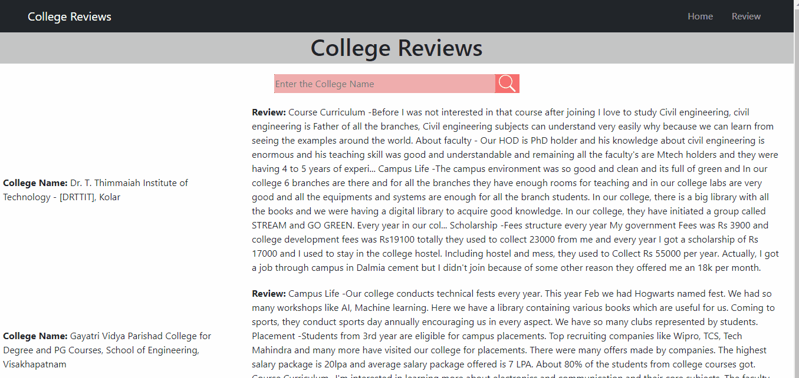

        
<br><br>
<h1 align="center"> College Review</h1>

A mern stack web project in which people can review colleges.
## About Project
Basically idea behind this project is, a platform where students can post reviews of their colleges, and also search colleges and see their reviews. This will help students to find a good college.
<br><br>
Welcome for pull requests.
<br>

## Tech Stack used--
<ul>
<li>JavaScript</li>
<li>React js(jsx)</li>
<li>Node js</li>
<li>Express js</li>
<li>MongoDB</li>
<li>Python</li>
<li>Docker</li>
</ul>

# Preview


## Deployment
### <li>This app is being deployed to heroku using github action automated CI.
### <li>Kubernetes Deployment
<li>You can deploy it to kubernetes using gcloud CLI
<li>Clone the repo
```sh
git clone https://github.com/tush-tr/college-review
cd college-review
```

<li>Run the deploy.sh script

```sh
source deploy.sh
```

## How to use locally?
### Prerequisites
-- Node js
<br>
Follow these steps
<pre>$ git clone https://github.com/tush-tr/college-review</pre>
<pre>$ cd college-review </pre>
<pre>$ npm install</pre>
<pre>$ npm start</pre>
